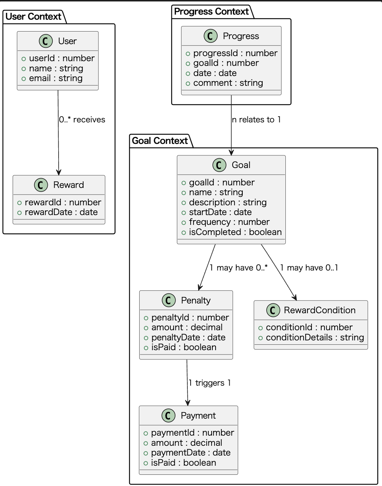
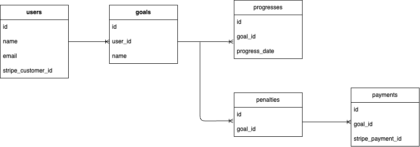

## Outline

This repository is a project designed to learn the basics of NestJS and DDD.
Based on onion architecture.

## Architecture overview
### Layers
- **Presentation**
- **Application**
- **Infrastructure**
- **Domain**

## UML Diagram

### CQRS

## Technology Stack
- NestJS
- TypeORM

## Swagger
http://localhost:3000/api

## ER

